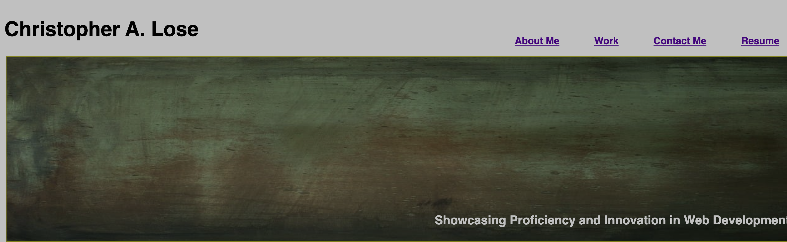
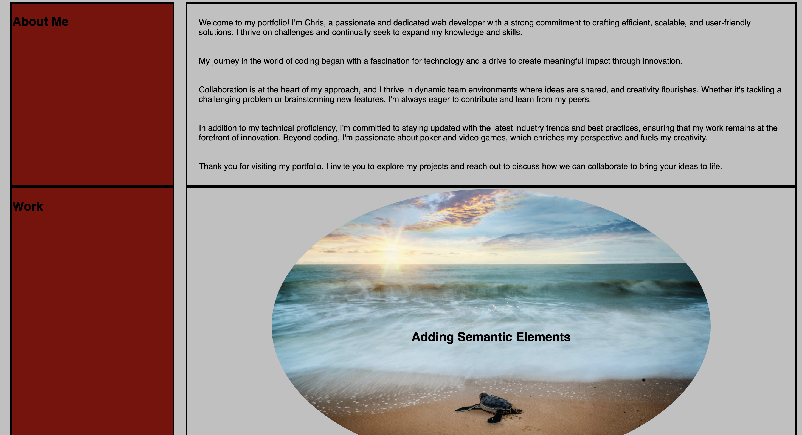
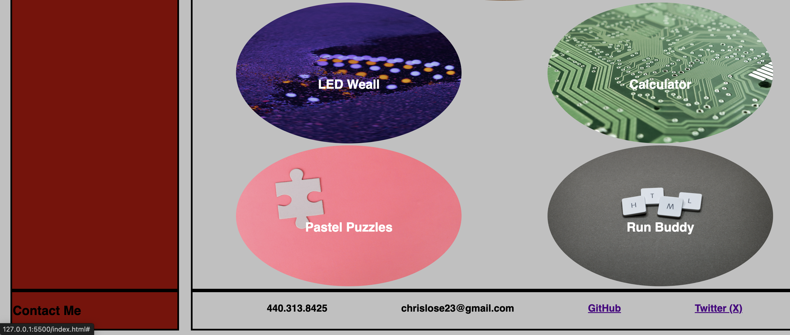

# 02-Challange - My Profile Page

## Description

This application was built to showcase my work as I grow in the coding industry. 
I built this application tocollect my work and allow the community to veiw what I have done.
The site allows my a space to hold organize what I have created and add to it over time.
I learned that what I build today will not look like what I will build tomorrow.

## Usage

Below is the header of my application. The right side has a menue for the site.

This is the work section of my site, showcasing my top projects. The largwe image is my most recent application.

Finally the last section contains the remaining bodies of work and a contact me section.

## License

This application will use the MIT license.

---